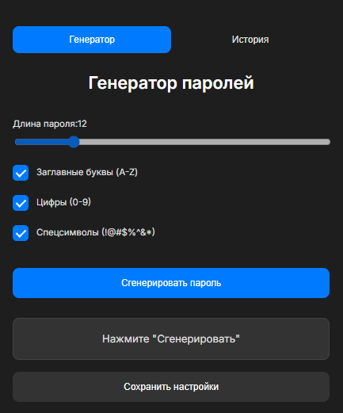
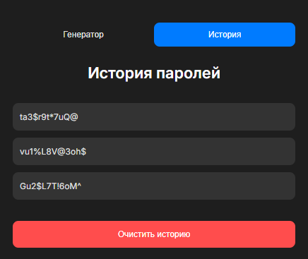

## **Генератор паролей для браузера**

Это расширение для браузера, которое позволяет генерировать удобные для ввода и запоминания пароли с возможностью настройки сложности. Пароли можно копировать в буфер обмена, а также сохранять их историю для дальнейшего использования. Всё это упаковано в современный интерфейс с тёмной темой и приятным дизайном.

---

### **Скриншоты**

#### Вкладка генератора:


#### Вкладка истории:


---

### **Основные функции**

1. **Генерация паролей**:
   - Настройка длины пароля с помощью ползунка.
   - Возможность включения/выключения:
     - Заглавных букв (A-Z).
     - Цифр (0-9).
     - Специальных символов (!@#$%^&*).

2. **История паролей**:
   - Все сгенерированные пароли сохраняются в истории.
   - Возможность копирования паролей из истории по клику.
   - Очистка всей истории одним нажатием.

3. **Современный интерфейс**:
   - Тёмная тема.
   - Удобные вкладки для переключения между генератором и историей.

4. **Настройки**:
   - Сохранение настроек сложности пароля между сессиями.

---

### **Как использовать**

1. **Установка**:
   - Скачайте репозиторий.
   - Перейдите в `chrome://extensions/`.
   - Включите режим разработчика.
   - Нажмите "Загрузить распакованное расширение" и выберите папку с расширением.

2. **Генерация пароля**:
   - Откройте расширение.
   - Настройте длину и сложность пароля.
   - Нажмите "Сгенерировать пароль".
   - Кликните на пароль, чтобы скопировать его в буфер обмена.

3. **История паролей**:
   - Перейдите на вкладку "История".
   - Кликните на любой пароль, чтобы скопировать его.
   - Нажмите "Очистить историю", чтобы удалить все сохранённые пароли.

---

### **Как установить и запустить**

1. Клонируйте репозиторий:
   ```bash
   git clone https://github.com/dimatayper/passwordGenExtention.git
   ```
2. Установите расширение в браузере:
   - Откройте `chrome://extensions/`.
   - Включите режим разработчика.
   - Нажмите "Загрузить распакованное расширение" и выберите папку с проектом.

---

### **Лицензия**

Этот проект распространяется под лицензией **Apache-2.0 license**. Подробности см. в файле [LICENSE](LICENSE).
